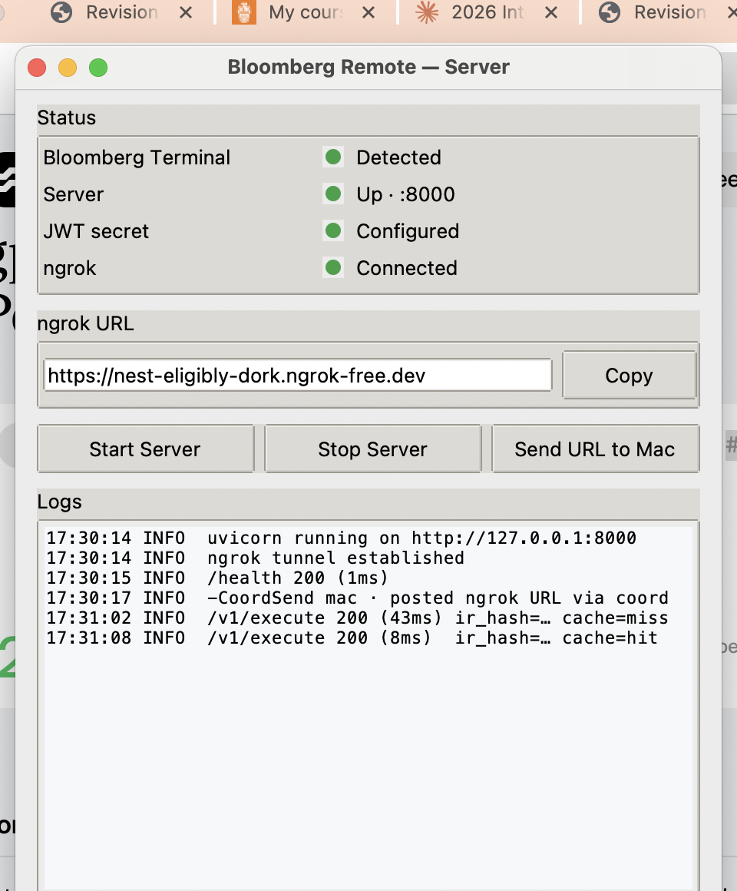
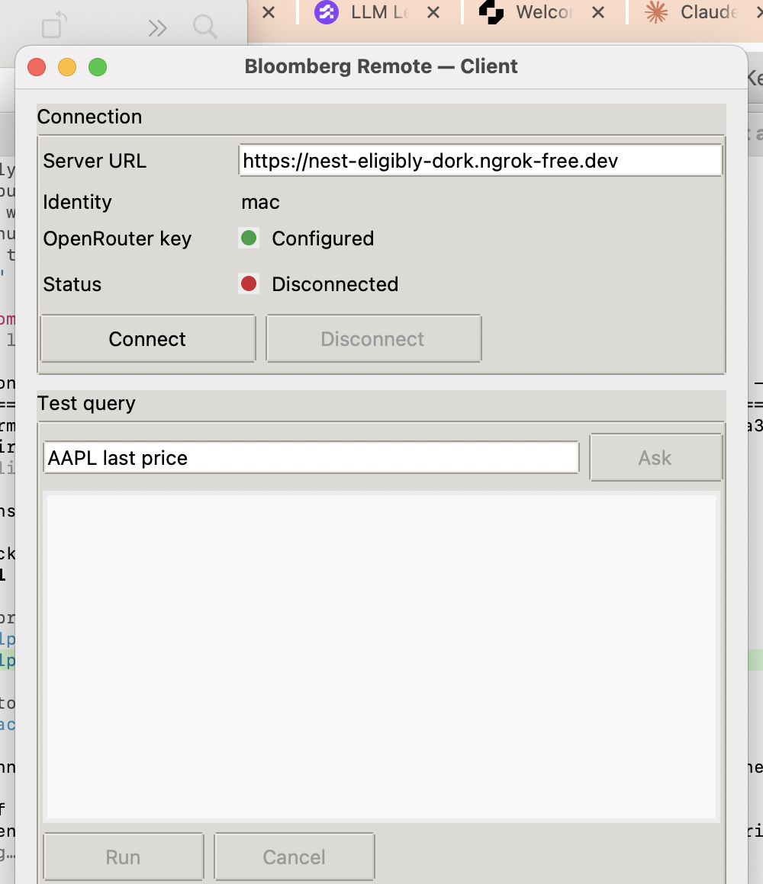

# M9 — Desktop UI for both ends (IBKR-style)

> Status: planned, not implemented. Next session picks up here.
> Driver: Krishna 2026-05-08 — wants a small desktop UI per side that
> mirrors how Interactive Brokers TWS Gateway looks: a single window
> with a Connect button, status LED, and the URL/credentials field.
> "Start a session on Windows, connect to it on Mac."

## Goal

Replace today's "ssh into Win + run setup.ps1 + paste ngrok URL into
Mac code" flow with a double-click experience on each side:

- **Windows**: double-click a launcher → small window with `[Start
  Server]` / `[Stop Server]`, server status LED, ngrok URL displayed
  with a Copy button, "Send URL to Mac" button. Bloomberg Terminal
  must already be running and logged in (UI just shows its status).
- **macOS**: double-click a launcher → small window with the server
  URL (auto-populated from the latest coord ping), identity readout,
  OpenRouter key indicator, `[Connect]` button → status LED goes
  green when paired. Optional second pane for the NL → IR → Run flow
  using `ask()` + `host.execute()`.

The validator stays the trust boundary on the Mac side; the UI is
purely a friendlier shell over the existing `RemoteHost` and
`blpremote-ask` surfaces. No new IR ops, no new auth surface — just
ergonomics.

## Mockups

Real Tkinter renders of both windows, captured 2026-05-12. No
behaviour — pure widget tree, ttk `clam` theme, IBKR-style
restraint. Source scripts live at `tools/m9_mockups/` and can be
re-rendered locally with `python tools/m9_mockups/server_ui_preview.py`
or `client_ui_preview.py`.

**Windows server UI** — `tools/blpremote-server-ui.py` (win):

**macOS client UI** — `tools/blpremote-client-ui.py` (mac, real
implementation, captured 2026-05-12):

## Tiers (preferred → fallback)

### Tier A — Standalone `.exe` / `.app` (Krishna's ideal)

User downloads a single artifact per OS. No Python required on
their box.

- **Windows**: `blpremote-server.exe` built with **PyInstaller**
  (`--onefile --windowed`). Bundles Python + FastAPI + uvicorn +
  blpapi + the rest of `blpremote_server`. ngrok stays as a sidecar
  binary the .exe spawns, since bundling ngrok itself is a license
  question we don't need to answer.
- **macOS**: `Bloomberg Remote.app` built with **py2app** (or
  PyInstaller — py2app produces nicer Mac bundles). Bundles
  `blpremote_client` + `openai` + `pandas` + `polars`.
- **Code signing**: macOS without a $99/yr Apple Developer ID will
  show a Gatekeeper warning ("unverified developer") on first open;
  user right-clicks → Open → Open. Acceptable if Krishna is the
  only user; document it. Windows SmartScreen has the equivalent
  "More info → Run anyway" warning. Skip notarisation.
- **Sizes**: expect 80–150 MB per artifact. Both ship most of the
  Python stdlib + the dep tree.
- **Build script**: `tools/build/build-server-exe.ps1` and
  `tools/build/build-client-app.sh`. Manual run for now; CI is
  overkill at this scope.

Rough estimate: 2–3 hours per side once Tier B is done. The hard
part is hitting the per-OS quirks (Tkinter on macOS Sonoma+ has its
own pkgresources issues; PyInstaller misses some hidden imports).
Tier A is best done as a follow-up PR after Tier B is shipped and
running.

### Tier B — Python + Tkinter + launchers (fallback)

Same UI code, but the user has Python installed (`setup.ps1` /
`setup.sh` provisions it) and double-clicks a launcher script.

- **Windows**: `START_SERVER_UI.bat` → `python tools/blpremote-server-ui.py`.
- **macOS**: `Connect.command` → `python tools/blpremote-client-ui.py`.
  `.command` files are the macOS equivalent of `.bat` (executable text
  files Finder treats as double-clickable). chmod +x in the repo.

Why this is good enough: the UI code is identical to Tier A; only
the packaging differs. Shipping Tier B first means the UI surface
is real and tested before we wrestle PyInstaller. If Tier B is
acceptable, we may never need Tier A.

Rough estimate: 3–4 hours total.

## Windows server UI — scope

Window title: `Bloomberg Remote — Server`. ~5–7 widgets total.

- **Status block** (read-only):
  - Bloomberg Terminal: detected ✓ / not running ✗ (poll a local BBG
    process; if absent the server can't do anything anyway).
  - Server: Up ✓ / Down ✗ — polled from `/health` every 2s.
  - JWT secret: configured ✓ / using insecure default ✗ (read from
    settings; this is the M5(A) check we already do).
  - ngrok URL: `https://nest-eligibly-dork.ngrok-free.dev` (read-only
    text field, with `[Copy]` button).
- **Buttons**:
  - `[Start Server]` — invokes `setup.ps1` underneath (or a leaner
    in-process subprocess.Popen of uvicorn + ngrok, then auto-coord-post).
  - `[Stop Server]` — kills the spawned subprocesses.
  - `[Send URL to Mac]` — calls `python tools/coord.py send mac
    <url>` (we already auto-do this on `setup.ps1 -CoordSend mac`,
    but a manual button is nice for re-sends).
- **Logs tail**: last 20 lines of the server's stdout/stderr in a
  scrolled text widget. Helpful for "why won't it start".

Implementation: `tools/blpremote-server-ui.py`, ~150 LOC, pure Tkinter.

## macOS client UI — scope

Window title: `Bloomberg Remote — Client`. ~6–8 widgets total.

- **Connection section**:
  - Server URL: text field, auto-populates from the most recent
    coord ping (parse last `mac/inbox` for the ngrok URL).
  - Identity username: read-only readout from `~/.blpremote/identity.json`.
  - OpenRouter key: ✓ Configured / ✗ Missing (presence check on
    `~/.blpremote/openrouter.json` and `OPENROUTER_API_KEY` env).
- **Buttons**:
  - `[Connect]` — calls `RemoteHost(url, ...).pair()` via the
    identity flow; flips status LED on success.
  - `[Disconnect]` — drops the cached token, flips LED off.
  - `[Test query]` — opens a small modal: text field for an English
    prompt → calls `ask(host, prompt)` → shows the explain string +
    plan ops → `[Run]` / `[Cancel]` → `host.execute()` shows result
    in a result panel. Same trust pattern as `blpremote-ask` CLI;
    this is just the GUI front-end of it.
- **Status LED**: Disconnected (grey) → Connecting (yellow) →
  Connected (green) → Error (red, with last error text on hover).

Implementation: `tools/blpremote-client-ui.py`, ~200 LOC, pure
Tkinter. Re-uses `blpremote_client.RemoteHost`,
`blpremote_client.llm.ask`, `blpremote_client.identity`. No new
business logic — only Tkinter glue.

## `setup.sh` (macOS first-time install)

Mirrors `setup.ps1`:

1. Detect Python ≥3.10 (Homebrew or system).
2. Create `.venv/` at repo root (idempotent).
3. `pip install -e packages/blpremote_client[llm,pandas,polars]`.
4. Bootstrap `~/.blpremote/` skeleton if absent.
5. Prompt for OpenRouter key if `openrouter.json` absent (skip with
   a warning if user just wants `bdh()` etc, not LLM features).
6. Drop `Connect.command` onto the user's Desktop pointing at the
   client UI script. (Tier A: drop the `.app` instead.)

~80 LOC bash. Idempotent — running it again is a no-op except for
re-prompting for the key if it's missing.

## README rewrite (bundle into the same PR)

The current README pre-dates the entire revamp:

- Still shows `protocol_version: "1.0"`, `collect_refdata_response`
  (deprecated alias). Should be 1.1 + `collect_response`.
- No mention of subscriptions, schema endpoints, `/metrics`, audit
  log, request cache, rate limits, identity, dataframes, or
  `blpremote-ask`.
- Install section says "pip install -e ." with no extras and no UI
  story.
- The "username/password" pairing flow is what M5(C) replaced with
  the identity file pattern.

Rewrite scope:

- New `Quick start` section with the double-click flow per OS.
- Architecture diagram updated to show: long-lived sessions,
  reconnect, SSE subscriptions, schema cache, audit + metrics.
- Drop the stale IR sample, replace with a 1.1-shaped one.
- Add `LLM` section pointing at `docs/M8_LLM_GUIDE.md`.
- Add `Subscriptions` section pointing at `docs/M2_IR_CONTRACT.md`
  + `subscribe()` example.
- Add `Observability` section: `/metrics`, JSONL audit log,
  cache hit counters.
- Drop the `strategies/` section if those files are gone (check at
  rewrite time — they were in the original README but may have
  been pruned).
- Two screenshots: server UI and client UI.

## State machine — LED palette + button gating (locked 2026-05-12)

Mockup uses one happy colour everywhere; real wiring needs a small
state→colour table. Locked palette (GitHub Primer-aligned, matches
the restrained aesthetic):

| State                                                | Hex      | Examples                                                          |
|------------------------------------------------------|----------|-------------------------------------------------------------------|
| Happy                                                | `#2ea043` | Detected · Up · Configured · Connected                            |
| Transient                                            | `#d29922` | Starting · Connecting · Reconnecting                              |
| Unhappy                                              | `#cf222e` | Not running · Down · Default-secret · Disconnected · Error        |
| Unknown / probing (pre-first-poll)                   | `#8b8d91` | Initial render before first /health or tasklist completes         |

Encoded as a `_LED_COLOUR = {state: hex}` dict in the controller on
each side. Same palette mac + win.

**[Start Server] gating when Bloomberg Terminal not detected.**
Server M1 lifespan tolerates BBG-down (logs warning, /health
reports degraded). But: clicking Start → green ngrok + red BBG-not-
running row → confusing user experience. Decision (locked, win's
call to default, mac doesn't push back):

- Default: **disable [Start Server]** when BBG not detected; tooltip
  "Open Bloomberg Terminal first".
- Edge case acknowledged: if `tasklist`/psutil detection is flaky
  the user could get locked out of starting a fine server. If it
  shows up in practice, fall back to option (b) — allow Start with
  a confirm modal "Bloomberg Terminal not detected — server will
  run in degraded mode. Continue?". Re-decide then; no need to
  pre-build both paths.

**Server port label.** "Up · :8000" in the mockup hardcodes 8000;
real wiring pulls from `settings.port` (or the bound port from
uvicorn). One-line fix in chunk (b).

## Win-side refinements (from coord 2026-05-12)

Win read the plan and signed off on the win-side scope, with four
real refinements worth baking in from line 1:

1. **HiDPI on Windows ≥8**. Default Tk looks fuzzy on 4K / scaled
   displays unless you call `ctypes.windll.shcore.SetProcessDpiAwareness(1)`
   (or `SetProcessDPIAware()` on older Windows) **before** importing
   tkinter. Three lines, fixes a real-feel issue.
2. **Don't block the Tk event loop.** /health polling, subprocess
   output draining, "Send URL to Mac" — all go through
   `root.after(2000, refresh)` or a background `threading.Thread`
   feeding a `queue.Queue` that the main thread drains via `after`.
   Standard tkinter long-running-work pattern; mention in code
   comments so future-us doesn't accidentally `time.sleep` in the
   handler.
3. **ttk theme = `clam`**, not `vista` (Win 10/11 default). `clam`
   looks closer to the IBKR-style restraint we're after and works
   identically on macOS. Set with `ttk.Style().theme_use("clam")`.
4. **Setup.ps1 launch shape**: confirmed wrap, not port.
   - `subprocess.Popen(["powershell.exe", "-NoProfile",
     "-ExecutionPolicy", "Bypass", "-File", "setup.ps1",
     "-CoordSend", "mac"], stdout=PIPE, stderr=STDOUT, bufsize=1,
     text=True)`. Stream stdout into the logs tail via the
     queue+after pattern.
   - **Fast-path "already running"**: UI `[Start Server]` should
     call `/health` first; if 200, skip Popen and just flip the
     status LED to green. Don't blindly re-spin uvicorn over a
     running instance.
   - **Child-process cleanup on Stop**: `Popen.terminate()` ends
     powershell.exe but its spawned `python.exe` (uvicorn) and
     `ngrok.exe` can outlive it on Windows. Track the child PIDs
     out-of-band, or wrap the spawn in a job object so killing the
     parent cascades. Win will figure out the exact mechanism
     during implementation — flagging here so it's not forgotten.

## Win's chunk plan (when greenlit)

a. Skeleton: window + four status rows + three buttons + scrolled
   logs tail, no behaviour. ~50 LOC. Commit as a UI skeleton.
b. Status block wiring: BBG detect (tasklist / psutil), /health
   poll, JWT-secret check from settings, ngrok URL pulled from
   the location `setup.ps1` writes it (win to confirm path; likely
   `.coord/last_ngrok_url.txt`).
c. Buttons wired: `[Start Server]` → setup.ps1 Popen with
   /health fast-path; `[Stop Server]` → terminate + child cleanup;
   `[Send URL to Mac]` → coord.py send.
d. Launcher: `START_SERVER_UI.bat` at repo root.
e. Live verify: double-click the .bat, walk through
   start/stop/send-URL, post result on coord.

## Implementation order (next session)

1. **Tier B Tkinter UIs first** — server.py + client.py, 3–4h. Both
   sides functional via launchers and `python tools/<file>.py`.
2. **`setup.sh`** — 30min.
3. **Launcher scripts** — `START_SERVER_UI.bat`, `Connect.command`,
   chmod +x in repo. 15min.
4. **README rewrite** — 1h. Bundle into the same PR.
5. **Live verify** — Krishna double-clicks Connect.command on Mac,
   sees server URL auto-fill, clicks Connect, status goes green;
   on Win double-clicks START_SERVER_UI.bat, sees ngrok URL in the
   window, clicks Send URL to Mac.
6. **Tier A standalone packaging** — separate follow-up PR, only
   if Tier B isn't enough. PyInstaller for Win, py2app for Mac.
   2–3h per side.

## Open questions for Krishna

- Test query pane on Mac UI: include in MVP, or ship without and
  let users keep using `blpremote-ask` from the terminal? Lean
  *include* — it's the killer feature of the desktop app, and the
  CLI handles all the actual logic so it's just a Tkinter modal
  that calls the same code.
- Server UI auto-start on Win login? Out of scope for v1. If
  Krishna wants it, it's a `Set-ItemProperty Run` registry entry
  in setup.ps1 — 5 lines.
- App icons? Out of scope for v1. Tier A would use the default Tk
  icon; Tier B can stay icon-less since it's a script. If we ship
  Tier A we should pick a 256×256 PNG and convert per platform.

## Don't do (out of scope)

- A web UI / Electron app — heavier than the IBKR analogy implies,
  and the existing FastAPI server isn't meant to host frontend
  assets.
- Cross-machine UI on Windows showing the Mac client's state —
  unnecessary; coord pings already do that.
- Anything that modifies the IR contract or auth surface — those
  are locked at M2 / M5.

## Estimate

- Tier B end-to-end (UIs + setup.sh + launchers + README): 5–6h.
- Tier A standalone bundles: +4–6h follow-up PR.
- Best first attack: Tier B in one afternoon, ship, decide if
  Tier A is worth it.
